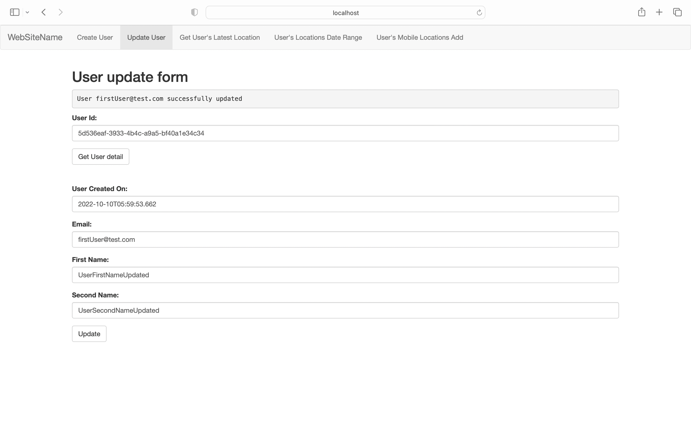

Project Name:
JITPay Demo assignment

Technology and Tools:
Spring boot, Mysql, IntelliJ IDEA

!! [Lessions learnt updated along with git history] !!

Setup to run application on machine:
1. Install MySQL
2. Create database with name, [jitdemo]
3. Check further details of the database setup in the [application.properties] file
4. Please find git location of the project:
[https://github.com/soebworking/jitdemo.git]
5. We may import git repository to IntelliJ/Eclipse
6. We may have set up Maven on machine
7. Once porject successfully imported to IntelliJ,
8. Run mvn clean install to generate application jar file along with javadoc jar file
9. And run the jar file which default setup on port 8080
10. After application successfully running, we may tap on URI:
    http://localhost:8080/

